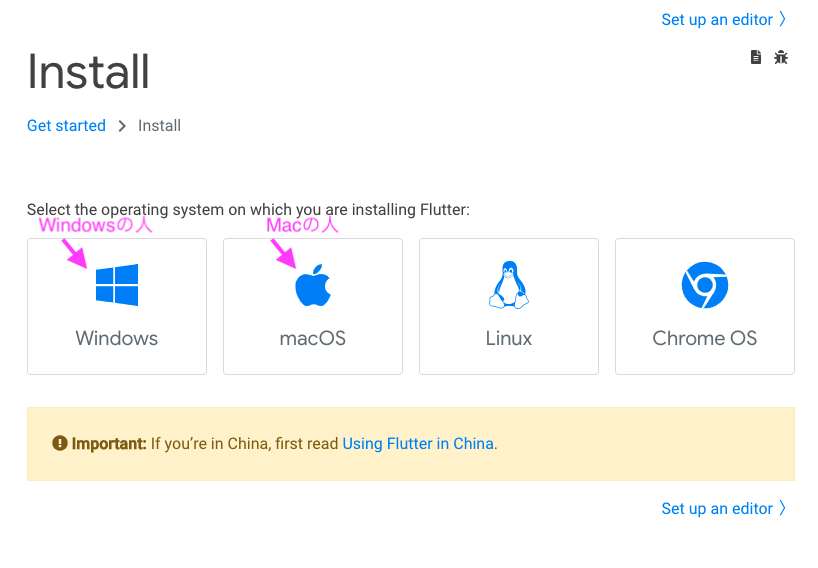
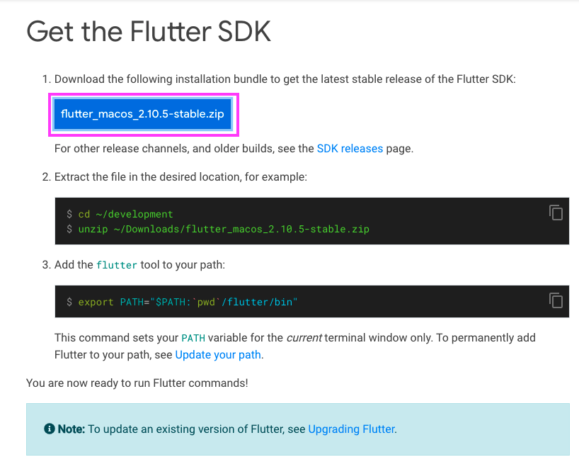

# Flutter SDKのインストール

Flutterを開発するために必要な「Flutter SDK」をインストールします。

 

## Flutter SDKとは

FlutterをPC上で動かすために必要なものが詰まったソフトです。

これをインストールしたらどのPCでもFlutterを使うことができます。

Software Development Kit = ソフトウェア開発キット

 

## Flutter SDKのインストール

1. 以下のURLをクリック

    [https://docs.flutter.dev/get-started/install](https://docs.flutter.dev/get-started/install)

1. 自分のOSを選択

    

1. Get the Flutter SDKのところにある 「fultter_xxxxx.zip」の青いボタンを押す。

    Macの場合:
     
    

     

    Windowsの場合:
     
    

1. ダウンロードされたzipファイルを展開する
    - Macの場合：zipファイルをダブルクリックする
    - Windowsの場合：zipファイルの上で右クリック > 展開する

1. ここからOS毎に解説

    - Macの場合

    - Windowsの場合

