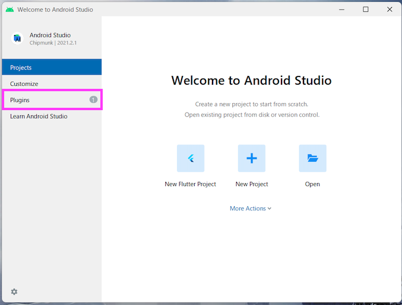
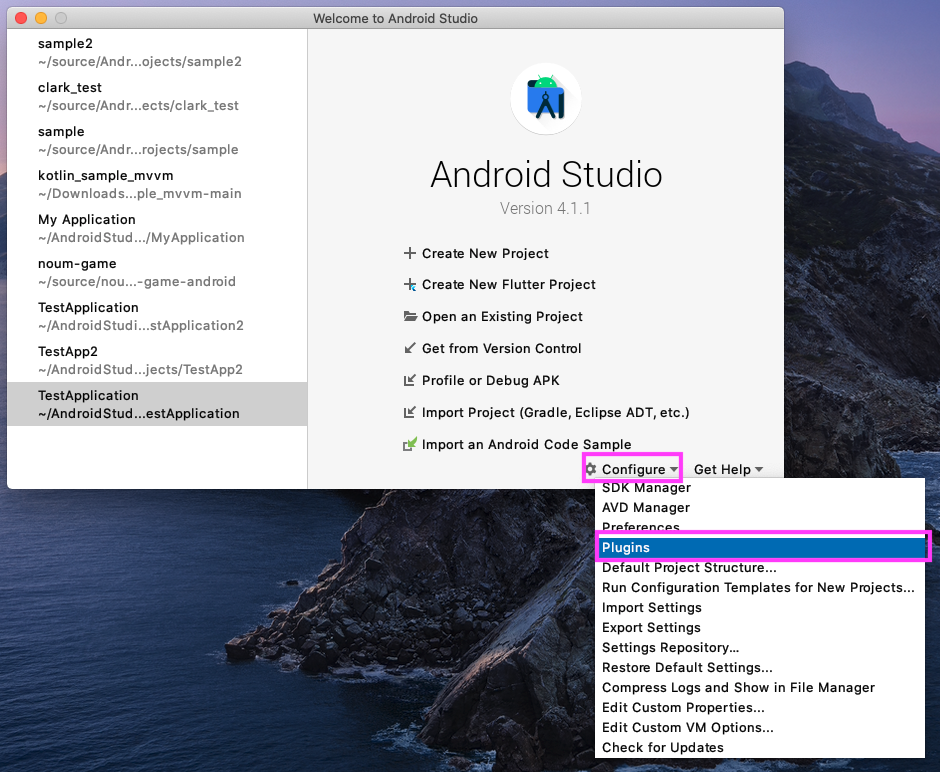
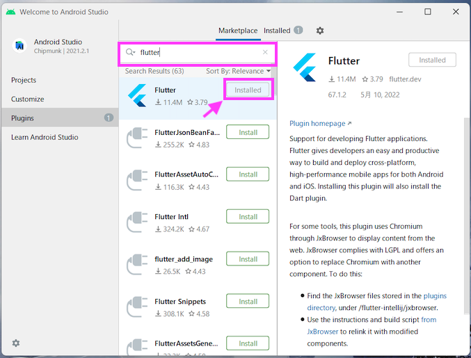
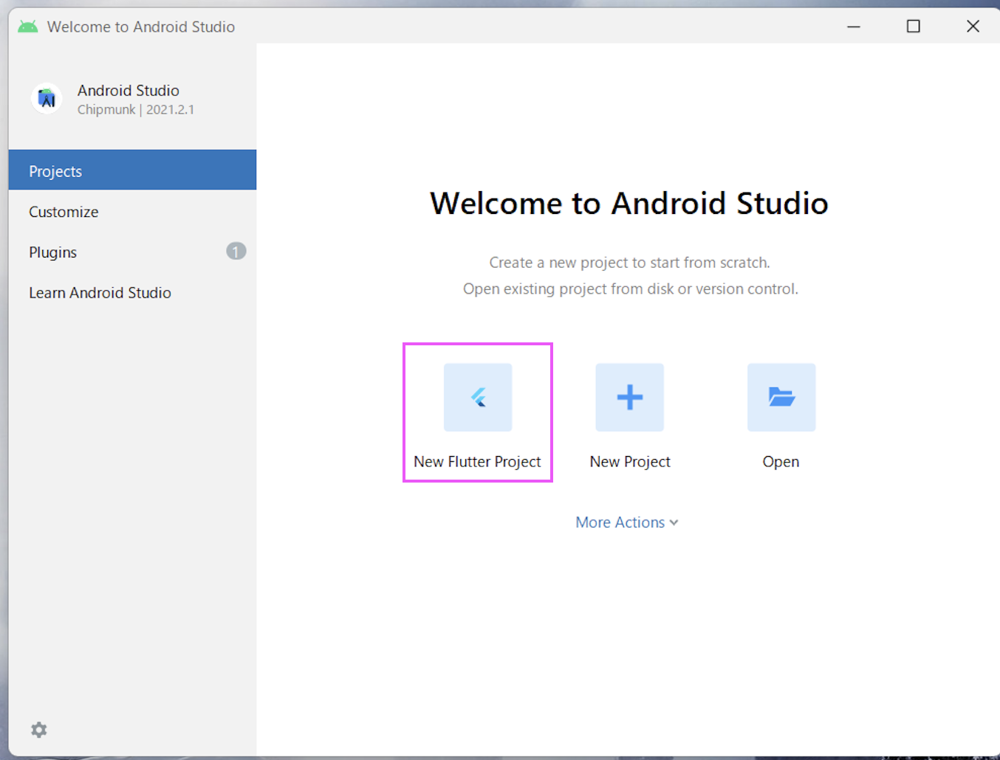

# flutterのプラグインをインストールする

Android Studioでflutterアプリを開発できるようにするプラグインをインストールします。

1. 初期画面でpuluginを押す。

    

    上記の画面が出ない人は、以下のようにボタンを押してください。
    

1. flutterと検索をし、Flutterの「install」を押す、

    

1. Android studioを再起動する

1. 初期画面で以下の「」が表示されていればOK

    

## コードフォーマットの設定

コードを変更した時に、自動で整形してくれる機能をOnにします。

1. Preferenceを開く

[画像]

1. 以下のところにチェックボックスをONにする。

[画像]
